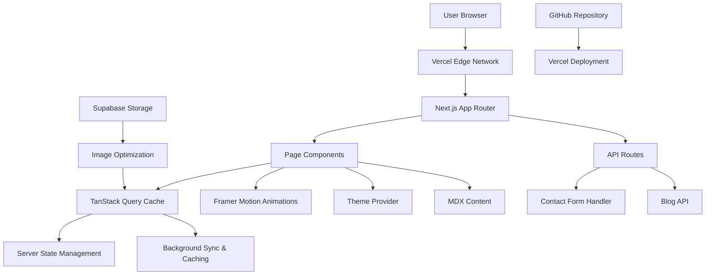

# Design Document

## Overview

This design document outlines the technical architecture and implementation approach for Marcel Scognamiglio's personal portfolio website. The site will be built as a modern, performant single-page application using Next.js 15+ with TypeScript, featuring smooth animations, dark/light theme support, and comprehensive accessibility compliance.

The design emphasizes a "nerdy and fluid" aesthetic with subtle gaming-inspired elements while maintaining professional appeal for recruiters. The architecture prioritizes performance, SEO optimization, and scalable content management.

## Architecture

### Technology Stack

**Frontend Framework:**
- Next.js 15+ with App Router for optimal performance and SEO
- TypeScript for type safety and developer experience
- React 18+ with concurrent features

**State Management & Data Fetching:**
- TanStack Query (React Query) for server state management and caching
- TanStack Router for type-safe routing (if needed for complex navigation)
- TanStack Table for any data table requirements in portfolio/blog sections

**Styling & Animation:**
- Tailwind CSS for utility-first styling and consistent design system
- Framer Motion for smooth animations and micro-interactions
- CSS Custom Properties for theme management
- Radix UI for accessible component primitives

**Content Management:**
- MDX for blog content with syntax highlighting
- Gray-matter for frontmatter parsing
- TanStack Query for content caching and synchronization

**Performance & SEO:**
- Next.js Image component with custom Supabase loader for optimized images
- Vercel Analytics for performance monitoring
- Next-sitemap for automated sitemap generation
- Structured data with JSON-LD

**Deployment & Hosting:**
- Vercel for hosting with edge functions
- Supabase for image storage and optimization
- GitHub for version control and CI/CD

### System Architecture



## Components and Interfaces

### Core Layout Components

**AppLayout Component:**
- Responsive navigation with smooth transitions
- Theme toggle with system preference detection
- Progress indicator for scroll position
- Accessibility-first keyboard navigation

**Navigation Interface:**
```typescript
interface NavigationItem {
  label: string;
  href: string;
  icon?: React.ComponentType;
  external?: boolean;
}

interface NavigationProps {
  items: NavigationItem[];
  currentPath: string;
  theme: 'light' | 'dark';
  onThemeToggle: () => void;
}
```

### Hero Section Components

**HeroSection Component (Modern ID Card Design):**
- Card-based layout with professional headshot and key information
- Animated card flip/rotation effects on hover
- Digital badge-style elements showing current status and location
- QR code integration for quick contact/resume access
- Subtle geometric patterns and gradients for modern tech aesthetic
- Interactive elements like status indicators and skill badges

**IDCard Interface:**
```typescript
interface IDCardData {
  personal: {
    name: string;
    title: string;
    location: string;
    status: 'available' | 'busy' | 'open-to-opportunities';
    avatar: string;
    qrCode: string;
  };
  badges: SkillBadge[];
  contact: {
    email: string;
    linkedin: string;
    github: string;
  };
  stats: {
    experience: string;
    projects: number;
    technologies: number;
  };
}

interface IDCardProps {
  data: IDCardData;
  theme: 'light' | 'dark';
  interactive?: boolean;
}
```

### Portfolio Components

**ProjectGrid Component:**
- Masonry layout with responsive breakpoints
- Hover effects revealing project details
- Lazy loading with intersection observer
- Filter functionality by technology stack

**ProjectCard Interface:**
```typescript
interface Project {
  id: string;
  title: string;
  description: string;
  technologies: string[];
  imageUrl: string;
  demoUrl?: string;
  githubUrl?: string;
  caseStudySlug?: string;
  featured: boolean;
  company?: string;
  year: number;
}

interface ProjectCardProps {
  project: Project;
  onHover: (project: Project | null) => void;
  variant: 'grid' | 'featured' | 'compact';
}
```

### Blog Components

**BlogList Component:**
- Article grid with featured post highlighting
- Category filtering with smooth transitions
- Reading time calculation
- Search functionality with debounced input

**BlogPost Interface:**
```typescript
interface BlogPost {
  slug: string;
  title: string;
  excerpt: string;
  content: string;
  publishedAt: Date;
  updatedAt?: Date;
  categories: string[];
  readingTime: number;
  featured: boolean;
  seo: {
    title: string;
    description: string;
    keywords: string[];
  };
}
```

### Interactive Components

**ContactForm Component:**
- Real-time validation with Zod schema
- Success/error states with animations
- Spam protection with rate limiting
- Accessibility-compliant error messaging

**ThemeToggle Component:**
- Smooth transition animations
- System preference detection
- Persistent storage with localStorage
- Reduced motion support

## Data Models

### Content Structure

**Portfolio Data Model:**
```typescript
interface PortfolioData {
  personal: {
    name: string;
    title: string;
    location: string;
    email: string;
    bio: string;
    avatar: string;
    resume: string;
  };
  experience: Experience[];
  skills: SkillCategory[];
  projects: Project[];
  testimonials: Testimonial[];
  social: SocialLink[];
}

interface Experience {
  id: string;
  company: string;
  position: string;
  startDate: Date;
  endDate?: Date;
  description: string;
  technologies: string[];
  achievements: string[];
}

interface SkillCategory {
  category: string;
  skills: Skill[];
}

interface Skill {
  name: string;
  proficiency: number; // 1-5 scale
  icon: string;
  description?: string;
}
```

### Theme Configuration

**Illustration-Inspired Color Palette:**
Based on the provided character illustration, the website will use a warm, earthy color scheme that evokes a friendly, approachable, and professional aesthetic.

**Theme Data Model:**
```typescript
interface ThemeConfig {
  colors: {
    // Primary colors from the illustration
    primary: {
      50: '#f7f5f0',   // Light cream from clouds
      100: '#ede8db',  // Soft beige
      200: '#d4c4a8',  // Warm beige
      300: '#c4a882',  // Character skin tone
      400: '#a68b5b',  // Darker skin tone
      500: '#8b6914',  // Brown hair color
      600: '#6b4e0a',  // Dark brown
      700: '#4a3507',  // Very dark brown
      800: '#2d2004',  // Almost black brown
      900: '#1a1302'   // Deep brown black
    };
    
    // Secondary colors from clothing and environment
    secondary: {
      50: '#f0f4f0',   // Very light sage
      100: '#e1ebe1',  // Light sage from sweater
      200: '#c4d4c4',  // Medium sage
      300: '#9bb89b',  // Sweater color
      400: '#7a9b7a',  // Darker sage
      500: '#5a7c5a',  // Deep sage
      600: '#4a6b4a',  // Forest green
      700: '#3a5a3a',  // Dark forest
      800: '#2a4a2a',  // Very dark green
      900: '#1a3a1a'   // Deep forest
    };
    
    // Accent colors from jeans and shoes
    accent: {
      50: '#f0f7fb',   // Very light blue
      100: '#e1effa',  // Light blue
      200: '#c4dff5',  // Soft blue
      300: '#8bb8d9',  // Jeans color
      400: '#5a9bc4',  // Medium blue
      500: '#4a8bb4',  // Deeper blue
      600: '#3a7ba4',  // Dark blue
      700: '#2a6b94',  // Very dark blue
      800: '#1a5b84',  // Deep blue
      900: '#0a4b74'   // Navy blue
    };
    
    // Warm accent from shoes
    warm: {
      50: '#fdf5f0',   // Very light peach
      100: '#fbeae1',  // Light peach
      200: '#f7d5c4',  // Soft peach
      300: '#e8a882',  // Shoe leather color
      400: '#d4925a',  // Medium brown
      500: '#c4824a',  // Deeper brown
      600: '#b4723a',  // Dark brown
      700: '#a4622a',  // Very dark brown
      800: '#94521a',  // Deep brown
      900: '#84420a'   // Rich brown
    };
    
    // Background colors from landscape
    background: {
      sky: '#c8d4c8',     // Soft sage sky
      clouds: '#f7f5f0',  // Cream clouds
      hills: '#9bb89b',   // Rolling hills green
      grass: '#7a9b7a',   // Grass green
      field: '#a68b5b'    // Golden field
    };
    
    // Neutral grays with warm undertones
    neutral: {
      50: '#fafaf9',   // Almost white with warm tint
      100: '#f5f5f4',  // Very light warm gray
      200: '#e7e5e4',  // Light warm gray
      300: '#d6d3d1',  // Medium light gray
      400: '#a8a29e',  // Medium gray
      500: '#78716c',  // Medium dark gray
      600: '#57534e',  // Dark gray
      700: '#44403c',  // Very dark gray
      800: '#292524',  // Almost black gray
      900: '#1c1917'   // Deep black
    };
    
    semantic: {
      success: '#7a9b7a',  // Sage green from sweater
      warning: '#e8a882',  // Warm brown from shoes
      error: '#d4925a',    // Deeper warm brown
      info: '#8bb8d9'      // Soft blue from jeans
    };
  };
  
  typography: {
    fonts: {
      heading: '"Inter", "SF Pro Display", system-ui, sans-serif',
      body: '"Inter", "SF Pro Text", system-ui, sans-serif',
      mono: '"SF Mono", "Monaco", "Cascadia Code", monospace'
    };
    scales: {
      xs: '0.75rem',    // 12px
      sm: '0.875rem',   // 14px
      base: '1rem',     // 16px
      lg: '1.125rem',   // 18px
      xl: '1.25rem',    // 20px
      '2xl': '1.5rem',  // 24px
      '3xl': '1.875rem' // 30px
    };
  };
  
  animations: {
    durations: {
      fast: '150ms',
      normal: '300ms',
      slow: '500ms'
    };
    easings: {
      easeInOut: 'cubic-bezier(0.4, 0, 0.2, 1)',
      easeOut: 'cubic-bezier(0, 0, 0.2, 1)',
      bounce: 'cubic-bezier(0.68, -0.55, 0.265, 1.55)'
    };
  };
}
```

**Design Aesthetic Principles:**
- **Warm and Approachable:** Using the character's warm skin tones and earthy colors
- **Professional yet Friendly:** Sage greens and soft blues create trust while remaining approachable
- **Illustrated Feel:** Subtle references to the hand-drawn aesthetic through rounded corners and soft shadows
- **High Contrast:** Ensuring accessibility while maintaining the warm, organic feel
- **Cohesive Branding:** Colors that work harmoniously across light and dark themes

## Error Handling

### Client-Side Error Boundaries

**Global Error Boundary:**
- Catches and logs React component errors
- Displays user-friendly error messages
- Provides recovery mechanisms
- Integrates with error reporting service

**Form Error Handling:**
- Field-level validation with immediate feedback
- Server error handling with retry mechanisms
- Network error detection and offline support
- Accessibility-compliant error announcements

### Performance Error Handling

**Image Loading Errors:**
- Fallback images for broken links
- Progressive loading with blur placeholders
- Error state handling for Supabase image transformations
- Retry mechanisms for failed loads

**Animation Error Handling:**
- Reduced motion preference detection
- Graceful degradation for unsupported features
- Performance monitoring for animation frame drops
- Fallback static states for critical animations

## Testing Strategy

### Unit Testing

**Component Testing with Jest & React Testing Library:**
- Test component rendering and interactions
- Mock external dependencies (Supabase, APIs)
- Test accessibility features (keyboard navigation, screen readers)
- Validate theme switching functionality

**Utility Function Testing:**
- Test animation helpers and easing functions
- Validate form validation logic
- Test theme calculation utilities
- Test content parsing functions

### Integration Testing

**Page-Level Testing:**
- Test complete user flows (navigation, contact form)
- Test responsive behavior across breakpoints
- Validate SEO meta tag generation
- Test theme persistence across page loads

**API Route Testing:**
- Test contact form submission
- Test blog content fetching
- Test error handling and rate limiting
- Validate response formats and status codes

### Performance Testing

**Core Web Vitals Monitoring:**
- Largest Contentful Paint (LCP) < 2.5s
- First Input Delay (FID) < 100ms
- Cumulative Layout Shift (CLS) < 0.1
- First Contentful Paint (FCP) < 1.8s

**Animation Performance:**
- Monitor frame rates during animations
- Test performance on lower-end devices
- Validate reduced motion preferences
- Test scroll performance with heavy animations

### Accessibility Testing

**Automated Testing:**
- axe-core integration for automated a11y testing
- Lighthouse accessibility audits
- Color contrast validation
- Keyboard navigation testing

**Manual Testing:**
- Screen reader testing (NVDA, JAWS, VoiceOver)
- Keyboard-only navigation testing
- High contrast mode testing
- Zoom level testing (up to 200%)

### Browser Compatibility Testing

**Target Browser Support:**
- Chrome 90+
- Firefox 88+
- Safari 14+
- Edge 90+

**Progressive Enhancement:**
- Core functionality without JavaScript
- Graceful animation degradation
- Fallback fonts and colors
- Basic responsive layout without CSS Grid

## Performance Optimization Strategy

### Image Optimization

**Supabase Image Transformations:**
- Automatic WebP conversion for supported browsers
- Responsive image sizing with Next.js Image component
- Lazy loading with intersection observer
- Blur placeholder generation

**Custom Image Loader:**
```typescript
const supabaseLoader = ({ src, width, quality }) => {
  return `https://project-id.supabase.co/storage/v1/render/image/public/${src}?width=${width}&quality=${quality || 80}&format=webp`
}
```

### Code Splitting & Lazy Loading

**Component-Level Splitting:**
- Dynamic imports for heavy components (blog, portfolio)
- Lazy loading for below-the-fold content
- Preloading for critical user paths
- Bundle analysis and optimization

**Content Splitting:**
- MDX content lazy loading
- Progressive image loading
- Deferred non-critical CSS
- Service worker for caching strategies

### Animation Performance

**Framer Motion Optimization:**
- Use transform properties for GPU acceleration
- Implement will-change CSS property strategically
- Debounce scroll-triggered animations
- Respect prefers-reduced-motion settings

**ID Card Animation Optimization:**
- CSS transforms for card flip/rotation effects
- GPU-accelerated transitions for smooth interactions
- Intersection Observer for scroll-triggered badge animations
- Optimized SVG animations for geometric patterns
- Performance monitoring and adaptive quality based on device capabilities